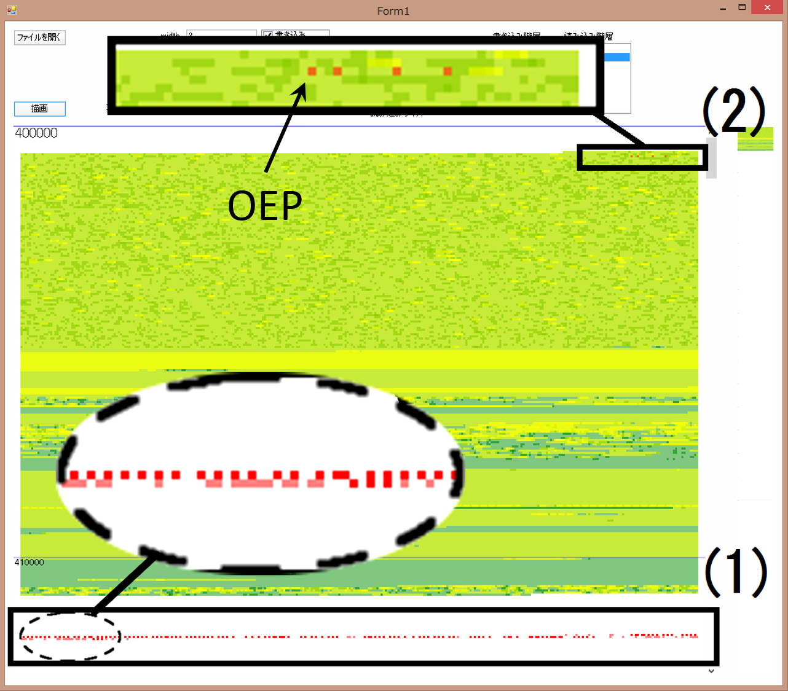
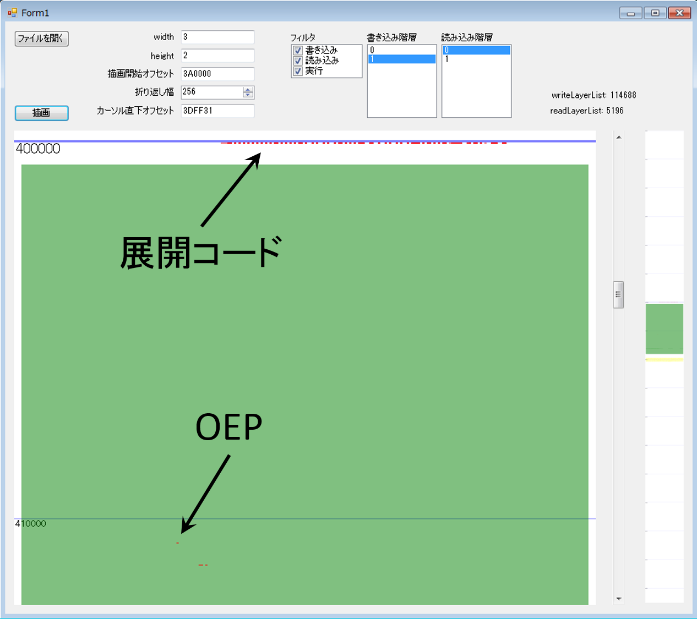
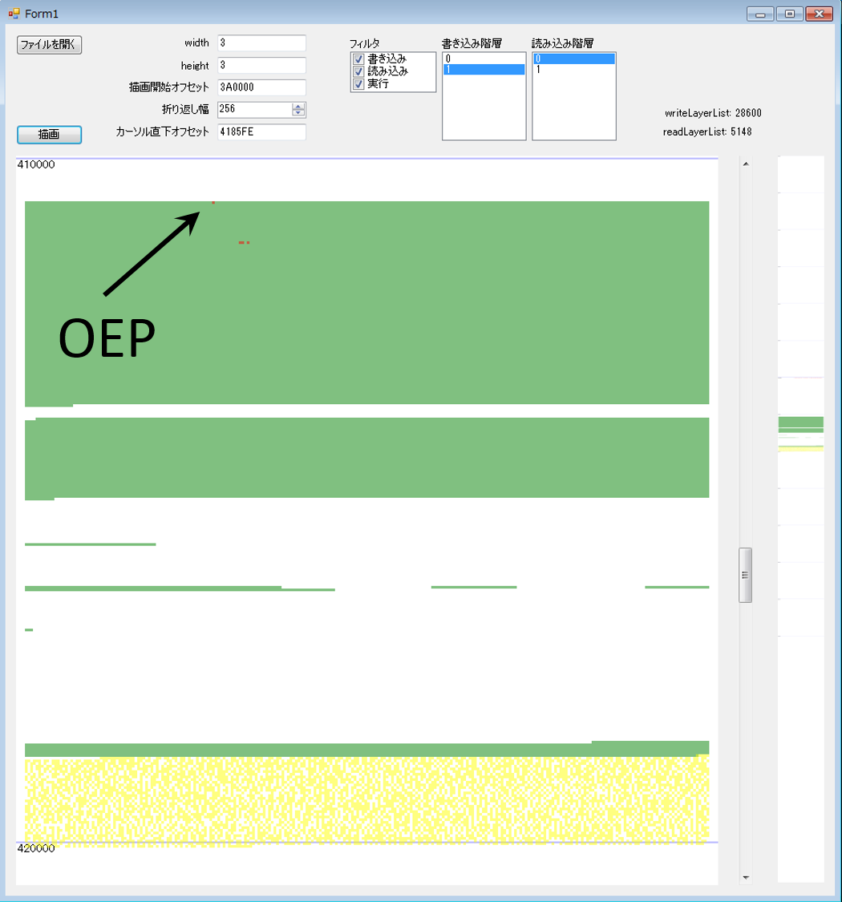
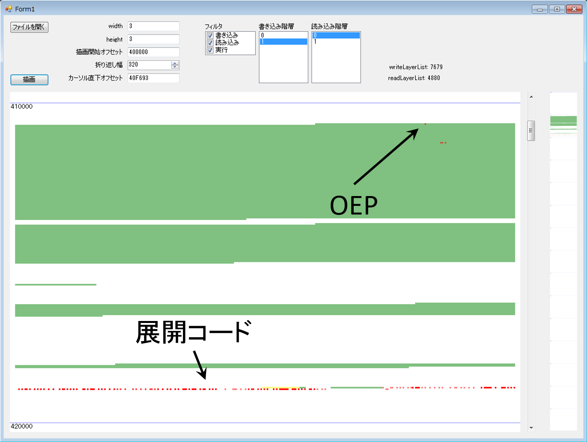
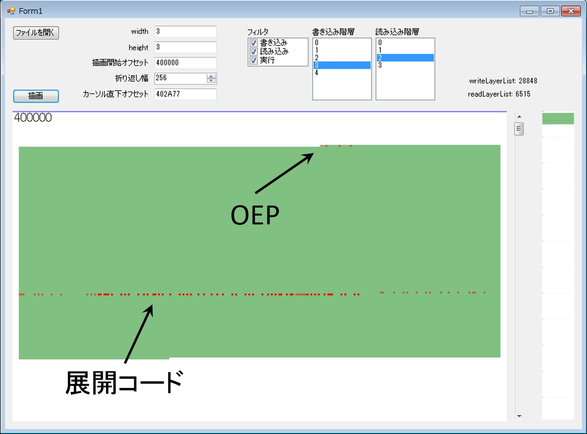
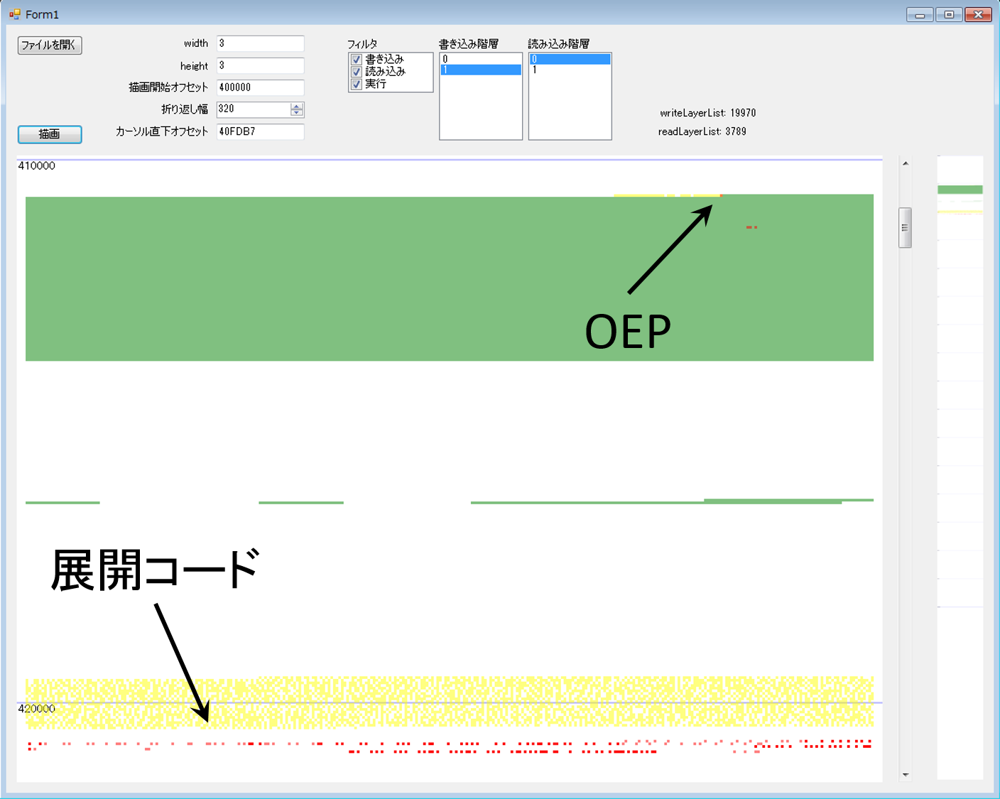
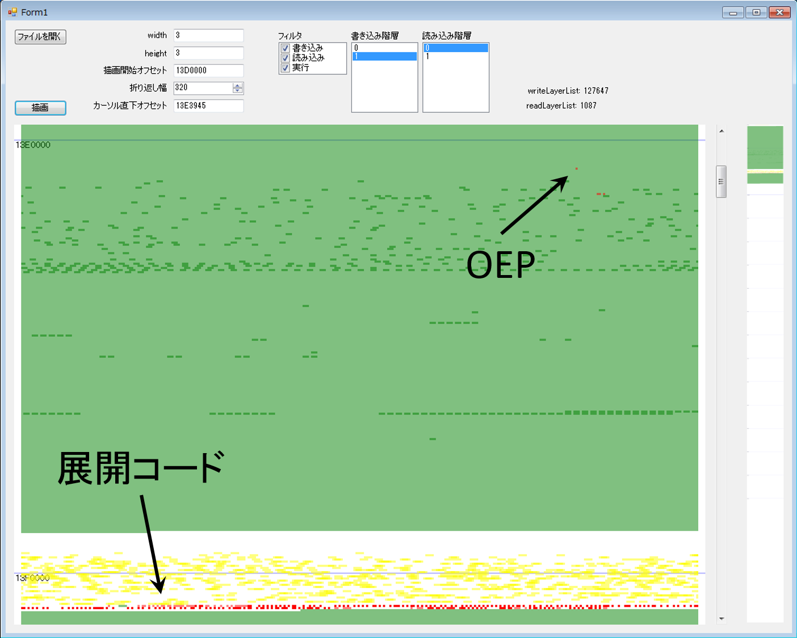

# 可視化例

- 読み込みアドレス: 黄色 
- 書き込みアドレス: 緑色 
- 実行アドレス: 赤色 

アクセス回数が多いほど色が濃くなります

## UPX 
https://upx.github.io/ 

## FSG 
http://www.download25.com/fsg-download.html

## MEW11 
http://www.softpedia.com/get/Programming/Packers-Crypters-Protectors/MEW-SE.shtml

## Packman 
http://packmanpacker.sourceforge.net/

## PEtite 
http://www.un4seen.com/petite/

多段にわたる書き込みと実行が確認できます

## RLPack 
http://www.softpedia.com/get/Programming/Packers-Crypters-Protectors/RLPack-Basic-Edition.shtml

## WinUpack 
http://www.softpedia.com/get/PORTABLE-SOFTWARE/Compression-Tools/Windows-Portable-Applications-Portable-WinUpack.shtml

